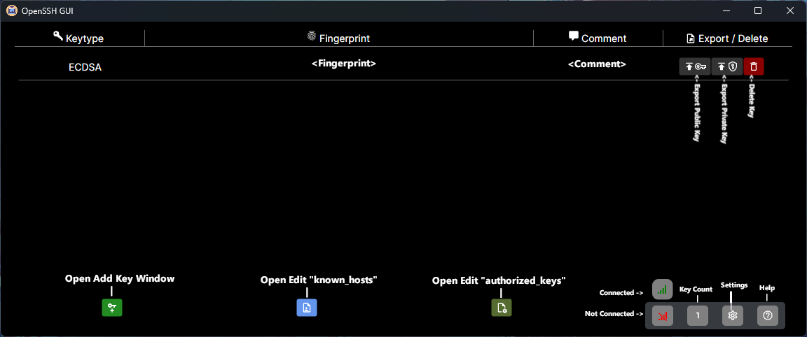
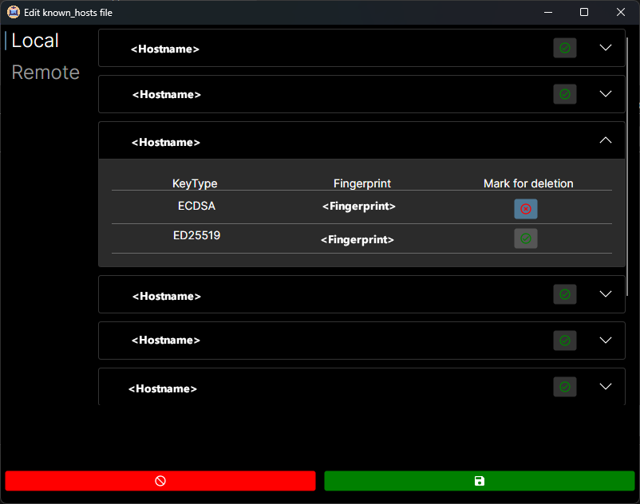

OpenSSHA-GUI

A GUI for managing your SSH Keys

### Installing

No Installation needed! Just run the OpenSSHA_GUI.exe 

## Usage
#### Main Window

#### Edit Known Hosts Window

Here you have a list of all "Known Hosts" from your "known_hosts" file.
If you want to remove one key from a Host, toggle the button of the specific Key.
If you want to remove the whole host, just toggle the button on the top label.

The three bottom buttons:

- Left: Cancel & Dismiss
- Middle: Reload file and revert all changes
- Right: Accept changes and write them to disk

## Plans for the future

- [ ] Add functionality for putting a key onto a Server
- [ ] Beautify UI
- [ ] Add functionality for editing authorized_keys
- many more not yet known!

## Authors

  - **Oliver Schantz** - *Idea and primary development* -
    [GitHub](https://github.com/frequency403)

See also the list of
[contributors](https://github.com/frequency403/OpenSSH-GUI/contributors)
who participated in this project.

## License

This project is licensed under the [GNU General Public License v3](LICENSE)
- see the [LICENSE](LICENSE) file for
details

