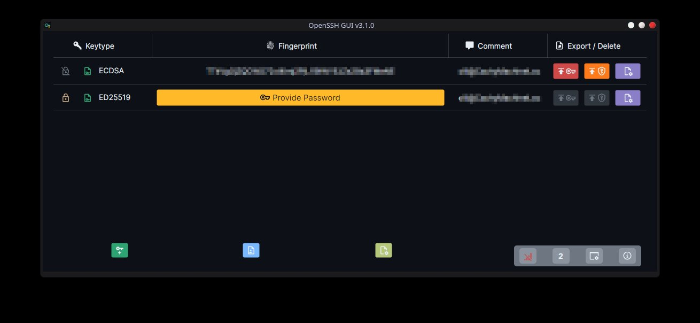
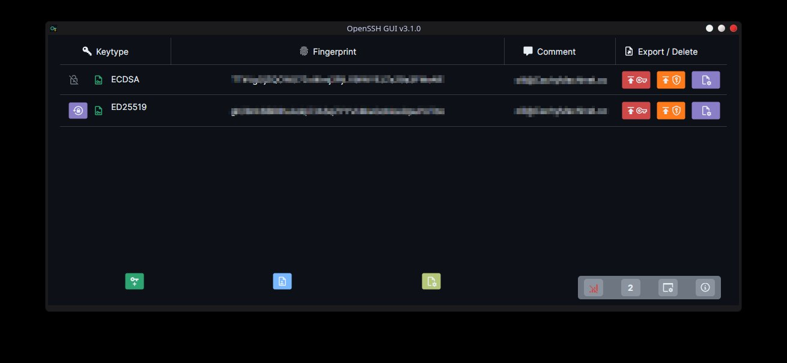
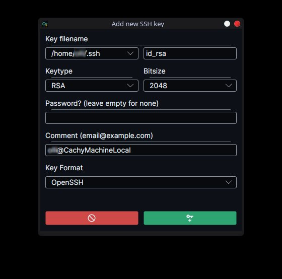
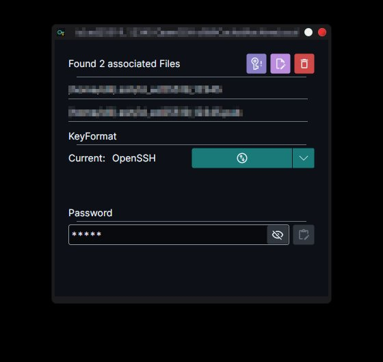
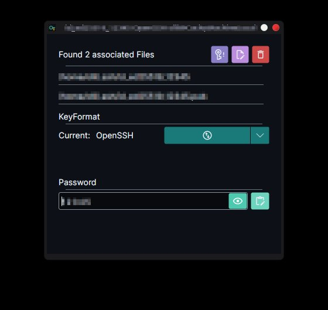
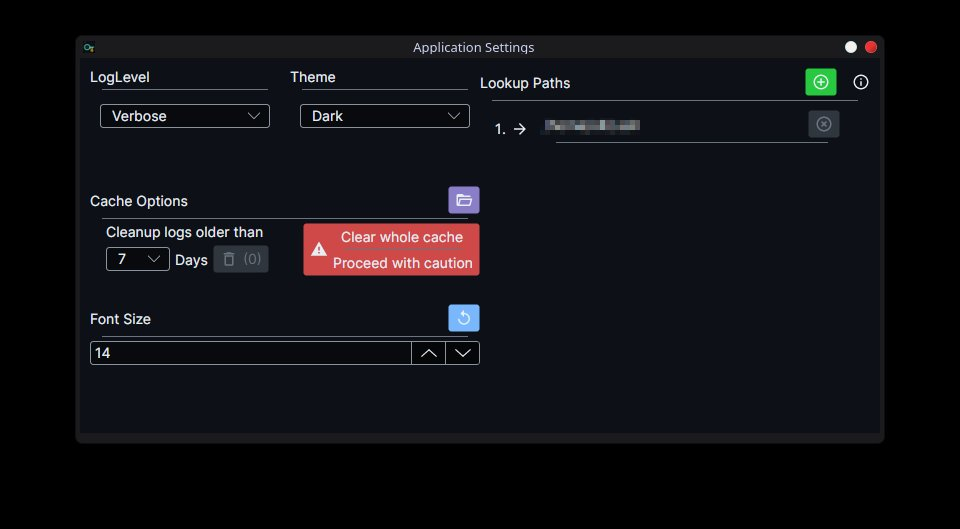
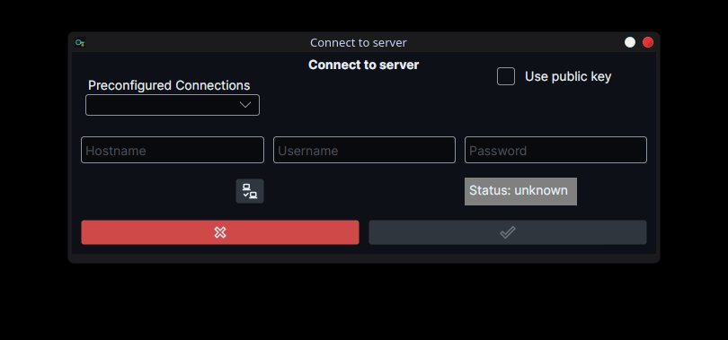
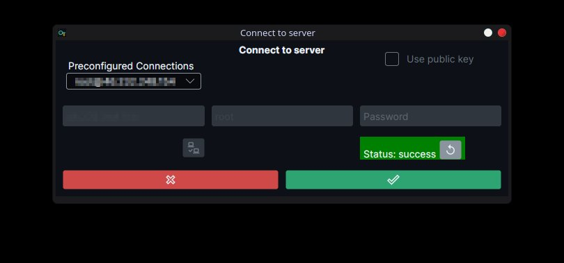
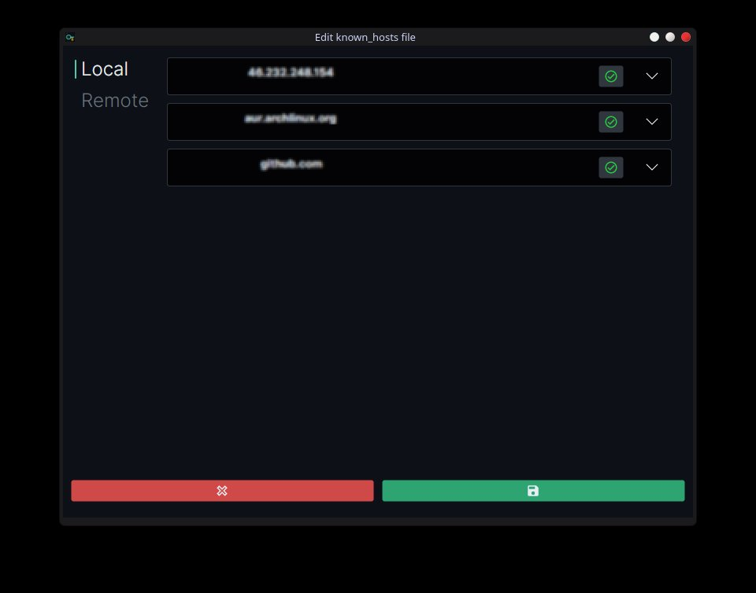

# OpenSSH GUI

A cross-platform desktop application for managing SSH keys, known hosts, and authorized keys — built with Avalonia UI, ReactiveUI, and .NET 10.

The goal of this project is to give users a modern, keyboard-friendly GUI for everything that usually requires `ssh-keygen` or hand-editing text files. It runs on **Windows**, **Linux**, and **macOS** and works entirely locally — no cloud, no telemetry.

---

## Features

- Browse, inspect, and manage all SSH key files in your configured lookup paths
- Generate new SSH keys (RSA, ECDSA, ED25519) with configurable bit size, comment, password, and format
- Convert keys between **OpenSSH** and **PuTTY v2/v3** formats in one click
- Change or clear the passphrase of any key file
- Rename key files safely (both private and public halves move together)
- Display SHA-256 fingerprints without ever unlocking the private key
- Open a **FileInfo** window per key to inspect, rename, delete, convert, or copy the password
- Edit the local `known_hosts` file; mark individual key entries or whole hosts for deletion
- Edit the local `authorized_keys` file
- Connect to a remote SSH server and edit its `known_hosts` and `authorized_keys` in the same UI
- Quick-connect from pre-configured `~/.ssh/config` host blocks
- Export public or private key content to the clipboard
- Application settings: log level, theme (dark/light/system), font size, lookup paths, cache cleanup
- Full dark and light theme with a VS Code–inspired teal/amber/red colour palette

---

## Screenshots

### Main Window



The main window lists all discovered SSH keys in a table. Each row shows:

- Lock/key icon indicating whether the key is encrypted and whether the passphrase has been provided
- Key algorithm (RSA, ECDSA, ED25519) and format (OpenSSH / PuTTY)
- SHA-256 fingerprint; password-protected keys show a **Provide Password** button inline
- Comment
- Action buttons: export public key, export private key, open FileInfo window

### Main Window — Password Entered



Once a passphrase is provided, the fingerprint column shows the actual hash and a **Forget Password** button appears.

### Add New SSH Key



Fields:

| Field | Notes |
|---|---|
| Key filename | Directory dropdown (from lookup paths) + filename text box |
| Keytype | RSA / ECDSA / ED25519 — default name updates automatically |
| Bitsize | Populated from the cryptographic legal key sizes for the chosen type; hidden for ED25519 |
| Password | Optional; leave blank for an unencrypted key |
| Comment | Defaults to `user@hostname` |
| Key Format | OpenSSH or PuTTY v2/v3 |

The **Add** button stays disabled until the filename passes validation (non-empty and not already on disk).

### FileInfo Window




Shows all files associated with the key (e.g. `id_ed25519` + `id_ed25519.pub`). From here you can:

- **Change password** — prompts for the new passphrase via a secure input dialog
- **Rename** — moves both halves, prompts for overwrite if a conflict is detected
- **Delete** — removes all associated files from disk
- **Convert format** — the SplitButton converts to the default target; the dropdown allows choosing any other available format
- **Password field** — shows masked passphrase with a toggle-visibility eye button and a copy-to-clipboard button

### Application Settings



| Section | Options |
|---|---|
| Log Level | Verbose / Debug / Information / Warning / Error / Fatal |
| Theme | Default (system) / Dark / Light |
| Cache Options | Delete log files older than N days; clear whole application cache |
| Font Size | Numeric up/down; reset button restores the default |
| Lookup Paths | Add/remove directories the key crawler searches |

### Connect to Server




The connection window supports:

- **Preconfigured connections** — populated automatically from `~/.ssh/config` host blocks that carry an `IdentityFile` directive
- Manual entry of hostname, username, and either a password or a public key from the recognised key list
- **Test connection** button — attempts a connection and shows a colour-coded status badge (unknown / success / failed)
- After a successful test, the **Accept** button becomes active and establishes the session for the rest of the UI

### Edit known_hosts



Displays every known host in a collapsible list. Each host shows its individual key entries (algorithm + fingerprint). Toggle buttons mark individual keys or entire hosts for deletion on save. A **Remote** tab appears when a server connection is active, allowing the same edits on the server's `known_hosts`.

---

## Architecture Overview

The project is split into four assemblies:

| Assembly | Role |
|---|---|
| `OpenSSH_GUI` | Avalonia application shell — views, view models, DI wiring, app lifecycle |
| `OpenSSH_GUI.Core` | Domain logic — key management, SSH config crawling, server connections, backup service |
| `OpenSSH_GUI.SshConfig` | SSH `~/.ssh/config` parser, serialiser, and `IConfiguration` provider |
| `OpenSSH_GUI.Dialogs` | Reusable modal dialogs (message box, secure password input, validated text input) |

### Key Components

**`SshKeyManager`** is the central service. It owns the observable collection of `SshKeyFile` instances and exposes async operations for generate, rename, change-password, change-format, delete, and reload. Every destructive operation backs up the affected files first and restores them on failure.

**`SshKeyFile`** is a reactive record. It uses `ReactiveUI.SourceGenerators` to expose observable properties for fingerprint, comment, key type, format, password state, and file metadata. The fingerprint is extracted without decrypting the private key by parsing the unencrypted public key blob directly (supports OpenSSH `.pub`, OpenSSH private key header, and PPK v2/v3 headers).

**`DirectoryCrawler`** is an `IAsyncEnumerable`-based crawler that reads `~/.ssh/config` identity files first (marking them as config-provided) and then enumerates the configured lookup directories for any remaining key files.

**`SshConfigParser`** is a zero-dependency recursive-descent parser for `ssh_config(5)` syntax. It handles `Host`, `Match`, and `Include` directives, wildcard patterns, quoted values, and inline comments, and exposes the result as an `IConfiguration` source so the rest of the app can bind directly via `IOptions<T>`.

**`ServerConnection`** wraps SSH.NET's `SshClient` and adds OS detection, remote `known_hosts`/`authorized_keys` read/write, and environment variable resolution on both Unix and Windows remote shells.

---

## Installation

No installer is required. Download the self-contained binary for your platform and run it directly.

The application creates the following paths on first launch if they do not exist:

- `~/.ssh/` (mode 700 on Unix)
- `/etc/ssh/` or `%PROGRAMDATA%\ssh\` (mode 755 on Unix)
- `~/.ssh/known_hosts` and `~/.ssh/authorized_keys`
- `%APPDATA%\OpenSSH_GUI\` — configuration and log files

---

## Configuration File

Application settings are stored as JSON at:

- **Linux / macOS:** `~/.config/OpenSSH_GUI/OpenSSH_GUI.json`
- **Windows:** `%APPDATA%\OpenSSH_GUI\OpenSSH_GUI.json`

The file is created automatically on first run. You can also edit it by hand — changes are picked up at runtime via `IOptionsMonitor`.

```json
{
  "LookupPaths": [ "/home/user/.ssh" ],
  "PreferredTheme": "Dark",
  "LogLevel": "Warning",
  "FontSize": 14,
  "LoggerConfiguration": {
    "LogFileName": "OpenSSH_GUI.log",
    "LogFilePath": "/home/user/.config/OpenSSH_GUI/log"
  }
}
```

---

## Building from Source

Requirements: .NET 10 SDK.

```bash
git clone https://github.com/frequency403/OpenSSH-GUI
cd OpenSSH-GUI
dotnet build
dotnet run --project OpenSSH_GUI
```

Tests:

```bash
dotnet test OpenSSH_GUI.Tests
```

---

## Security Notes

- Passphrases are handled as raw byte buffers (`SshKeyFilePassword`) backed by a `ReactiveBufferWriter<byte>`. The buffer is zeroed via `CryptographicOperations.ZeroMemory` when cleared or disposed.
- The secure password input dialog (`SecureInputDialog`) intercepts `TextInputEvent` at tunnel phase to avoid Avalonia's default string accumulation in the `TextBox` internal buffer.
- Private key files are never read unless the user explicitly provides a passphrase. Fingerprints and metadata are always extracted from the unencrypted public portions of the key file.
- All destructive file operations (rename, convert, change password) create backups before modifying any file and restore them automatically on failure.

---

## Known Limitations

- SSH config editing (local `~/.ssh/config` and remote `sshd_config`) is not yet implemented (placeholder menu items exist).
- Remote server operations require the connecting user to have read/write access to `~/.ssh/known_hosts` and `~/.ssh/authorized_keys` on the remote machine.

---

## Used Libraries

| Library | Purpose |
|---|---|
| [Avalonia UI](https://avaloniaui.net/) | Cross-platform UI framework |
| [ReactiveUI](https://reactiveui.net/) | MVVM + reactive extensions |
| [ReactiveUI.SourceGenerators](https://github.com/reactiveui/ReactiveUI.SourceGenerators) | Source-generated reactive properties and commands |
| [ReactiveUI.Validation](https://github.com/reactiveui/ReactiveUI.Validation) | Inline form validation |
| [SSH.NET](https://github.com/sshnet/SSH.NET) | SSH client |
| [SshNet.Keygen](https://github.com/darinkes/SshNet.Keygen) | Key generation and format conversion |
| [SshNet.PuttyKeyFile](https://github.com/darinkes/SshNet.PuttyKeyFile) | PuTTY key file support |
| [Material.Icons.Avalonia](https://github.com/SKProCH/Material.Icons) | Icon set |
| [Serilog](https://serilog.net/) | Structured logging |
| [BouncyCastle](https://www.bouncycastle.org/) | SHA-256 fingerprint computation |
| [Microsoft.Extensions.Hosting](https://learn.microsoft.com/dotnet/core/extensions/hosting) | DI, configuration, hosted services |

---

## Authors

- **Oliver Schantz** — idea and primary development — [GitHub](https://github.com/frequency403)

See also the [contributors](https://github.com/frequency403/OpenSSH-GUI/contributors) list.

## License

This project is licensed under the [MIT License](LICENSE).
