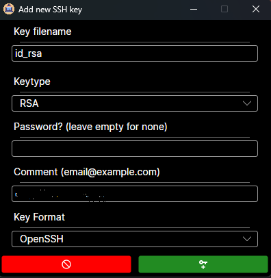
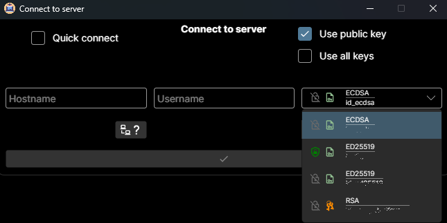

OpenSSH_GUI

A GUI for managing your SSH Keys - on Windows, Linux and macOS!  

The primary reason for creating this project was to give "end-users"  
a modern looking GUI for managing their SSH Keys - and making it easier  
to deploy them to a server of their choice.

The program I found -> [PuSSHy](https://github.com/klimenta/pusshy) was, in my opinion  
not as user-friendly as it could be. I also wanted to use this program on my different  
machines, running on Linux and macOS. So I decided to create my own!   

I hope you like it!

### Installing

No Installation needed! Just run the OpenSSHA_GUI.exe or .bin 

## Usage

It is free to you, if you connect to a Server or not.  
This program can be used on PC's (Local Machines) and Servers!

If you choose to connect to a server - ***beware!***  
This program - nor the author(s) take responsibility for saved messed up files!  
***Make a backup if you already have files!***

If you need help, open an [Issue]()

The program has a tooltip on every icon, describing what will happen  
if you click on it.

#### Main Window

#### Add SSH Key

#### Connect to a Server
Right-Click on the Connection-status icon and click "Connect" on the showing menu.

- You can also auth with a public key from the recognized keys on your machine!   

- You need to test the connection before you can submit it.  
If you get a connection error, an error window shows up.  

#### Edit Authorized Keys

Edit your local (or remote) authorized_keys!

In the remote Version you can even add a key from the recognized keys!
The key cannot be added, when it's already present on the remote!

#### Edit Known Hosts Window

Here you have a list of all "Known Hosts" from your "known_hosts" file.
If you want to remove one key from a Host, toggle the button of the specific Key.
If you want to remove the whole host, just toggle the button on the top label.

#### Export Key Window

#### Tooltips

***Tooltip when not connected to a server***   

***Tooltip from Key***   

***Tooltip from connection***   

## Plans for the future

- [X] ~~Add functionality for putting a key onto a Server~~
- [ ] Beautify UI
- [X] ~~Add functionality for editing authorized_keys~~
- [ ] Add functionality for editing local and remote SSH (user/root) Settings
- [ ] Add functionality for editing application settings
- [ ] Servers should be saved and quickly accessed in the connect window.
- many more not yet known!

## Authors

  - **Oliver Schantz** - *Idea and primary development* -
    [GitHub](https://github.com/frequency403)

See also the list of
[contributors](https://github.com/frequency403/OpenSSH-GUI/contributors)
who participated in this project.

## Used Libraries / Technologies

- [Avalonia UI](https://avaloniaui.net/) - Reactive UI

- [ReactiveUI.Validation](https://github.com/reactiveui/ReactiveUI.Validation/)

- [MessageBox.Avalonia](https://github.com/AvaloniaCommunity/MessageBox.Avalonia)

- [Material.Icons](https://github.com/SKProCH/Material.Icons)  

- [SSH.NET](https://github.com/sshnet/SSH.NET)

## License

This project is licensed under the [GNU General Public License v3](LICENSE)
- see the [LICENSE](LICENSE) file for
details

